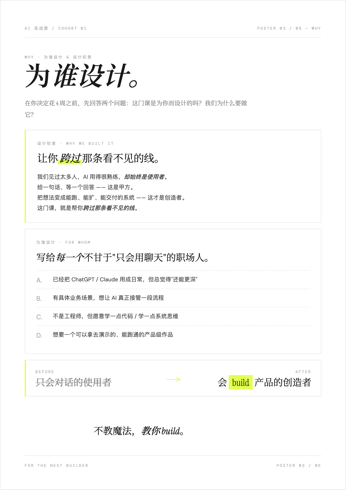
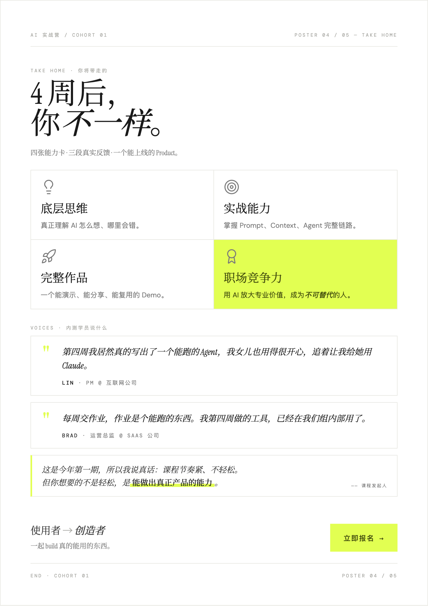

# 👁️ 熊布朗的 AI 实践课 Demo 02: Transformer 注意力可视化引擎 (Attention Visualizer)

[🌍 Read this in English](#english-version)

## 📖 这是什么？
这是 JumpX Labs **“熊布朗 AI 实战营”** 第二课的官方开源 Demo。
它是一款纯前端运行、零后端、**极客工业风 (Editorial Dev Tool)** 的注意力机制可视化教学工具。基于 React + Framer Motion 构建。

本系统旨在帮助初学者直观理解大语言模型（如 GPT）最核心的底层奥秘——**自注意力机制 (Self-Attention)**：
* AI 是如何跨越空间距离，理解一个词在特定语境下的真实含义的？
* 什么是多头注意力 (Multi-Head Attention)？不同的“头”是如何分工合作，分别处理语法、指代和因果关系的？
* 为什么说 Transformer 赋予了 AI “理解关系”的能力？

## 🚀 如何本地运行？

确保你的电脑上安装了 Node.js (推荐 v18+)。

```bash
# 1. 克隆本仓库
git clone https://github.com/JumpX-Labs/ai-bootcamp-demo02-attention-visualizer.git

# 2. 进入项目目录
cd ai-bootcamp-demo02-attention-visualizer

# 3. 安装依赖
npm install

# 4. 启动开发服务器
npm run dev
```
启动后，在浏览器中访问 `http://localhost:5173` 即可开始体验。

## 💡 如何学习和使用它？(核心交互流)

1. **📚 切换语料数据 (Dataset Selection)**
   * 在顶部导航栏切换预设的 3 条经典中文语料。例如经典的：“用毒毒毒蛇，毒蛇会不会被毒毒死？”
   * *教学点：体会多义词在不同上下文环境中的复杂性。*
2. **🧠 探索综合视图 (X-Ray Hover)**
   * 默认处于“综合视图”下，将鼠标悬停在左侧 Token 网格的任意词块上。
   * 观察底层触发的**能量连线**：连线越粗、节点陷落越深，代表该词对其他词的“注意力权重”越大。
   * 查看右侧极客感十足的 **Payload View (终端视角)**，精确观察当前焦点词对全局的注意力分配百分比。
3. **🎛️ 拆解多头注意力 (Multi-Head Analysis)**
   * 在 Token Grid 上方，点击切换不同的注意力头（如：语法结构头、实体指代头、因果推理头）。
   * *教学点：对比同一个焦点词在不同 Head 下的连线变化。你会发现 Head 1 可能在找动宾搭配，而 Head 2 跨越了半个句子找出了所有的“毒蛇”实体！这完美解释了 Multi-Head 的分工思想。*
4. **📖 查阅硬核教案**
   * 点击右上角的“查看配套教案”，阅读关于 Self-Attention 的深度图文解析，并跟着里面的 X-Ray 验证指引，在 Demo 中亲自验证这些理论。

---

## 🎓 课后实战作业：增加新的注意力头

**🐞 现有情况：**
目前系统内置了三种注意力头（语法、指代、因果），并且通过 `src/data.ts` 中的静态矩阵进行了 Mock 展示。

**🛠️ 你的任务 (Your Mission)：**
去源码里扩展它！为你最喜欢的某句话，增加一个全新的“注意力头”。
1. 使用编辑器（如 VSCode）打开本项目中的 `src/data.ts` 文件。
2. 找到 `PRESET_DATA` 数组中的任意一句话，比如“今天我去面包店...”。
3. 在 `heads` 数组中，仿照现有的结构，新增一个 `AttentionHead` 对象。
4. 自己定义一个规则（比如：**情感分析头**，让所有的词都强烈关注表示情绪的词“真的”、“好吃”）。
5. 编写你自己的 `matrix`（可以使用提供的 `buildMatrix` 辅助函数）。
6. **验收标准**：保存并在本地刷新页面，你的新 Head 应该会出现在按钮列表中，并且鼠标悬停时连线必须符合你设定的“情感关注”逻辑！

---

## 🐻 关于“熊布朗的 AI 实践课”

如果你对本项目背后的完整课程体系感兴趣，欢迎关注我们的实战营。

<div align="center">
  
  
  
  
</div>

---
---

<a name="english-version"></a>

# 👁️ Xiong Bulang's AI Bootcamp Demo 02: Transformer Attention Visualizer

## 📖 What is this?
This is the official open-source Demo for Lesson 2 of the **"Xiong Bulang AI Bootcamp"** by JumpX Labs.
It is a **brutalist, developer-style interactive visualization tool** built with React and Framer Motion, running entirely in the browser with no backend dependencies.

It is designed to intuitively explain the most critical mechanism behind LLMs like GPT: **Self-Attention**.
* How does AI overcome physical distance in a sentence to understand context-specific meanings?
* What is Multi-Head Attention? How do different "heads" collaborate to process syntax, coreference, and causality separately?

## 🚀 How to run locally?

Ensure you have Node.js installed (v18+ recommended).

```bash
git clone https://github.com/JumpX-Labs/ai-bootcamp-demo02-attention-visualizer.git
cd ai-bootcamp-demo02-attention-visualizer
npm install
npm run dev
```
Open `http://localhost:5173` in your browser.

## 💡 How to use & study with it?

1. **📚 Dataset Selection**: Switch between preset sentences in the top header.
2. **🧠 X-Ray Hover**: Hover over any Token in the grid. Watch the energetic SVG lines connect related tokens, dynamically illustrating the attention weights. Check the right-side **Payload View** terminal for exact percentage distributions.
3. **🎛️ Multi-Head Analysis**: Click the head selectors above the grid. Watch how the attention distribution completely changes based on the chosen "expert" (e.g., Syntax vs. Coreference).
4. **📖 Read the Docs**: Click the "View Lesson Plan" button to read the theoretical breakdown and follow the X-Ray verification steps.

---

## 🎓 Homework: Add a New Attention Head

**🛠️ Your Mission:**
Extend the visualizer by adding a custom Attention Head to the mock data!
1. Open `src/data.ts` in your editor.
2. Locate the `PRESET_DATA` array.
3. Add a new `AttentionHead` object to the `heads` array of any sentence.
4. Define a new concept (e.g., an **"Emotion Head"** that strongly attends to adjectives/adverbs).
5. Build your custom attention matrix.
6. **Success Criteria**: Refresh the app. Your new Head should appear in the UI, and the hover lines must perfectly reflect your custom logic!
